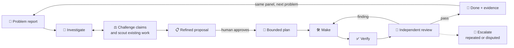
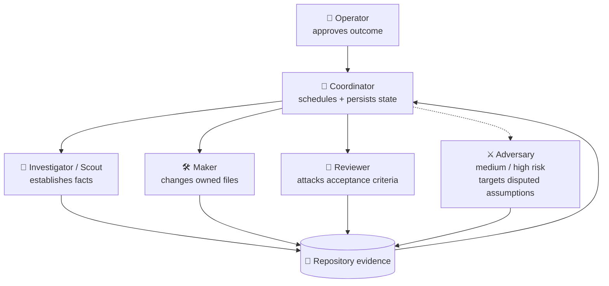
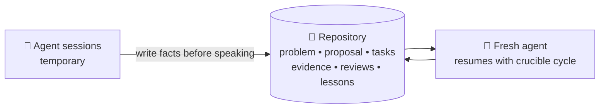

<p align="center">
  
</p>

<h1 align="center">Crucible</h1>

<p align="center">
  <strong>Turn a problem report into reviewed, verified work—without letting agents skip from allegation to implementation.</strong>
</p>

<p align="center">
  <a href="https://github.com/medhatgalal/crucible/releases/latest"></a>
  <a href="https://github.com/medhatgalal/crucible/actions/workflows/selftest.yml"></a>
  <a href="LICENSE"></a>
</p>

Crucible is a file-backed workflow for coordinating one or many coding agents. A fresh agent learns the
protocol from the repository, investigates whether a reported problem is real, proposes only the work
supported by evidence, waits for human approval, and iterates implementation and review until the
approved outcome is demonstrably done.

No daemon. No database. No package manager. No permanent agent memory. Just POSIX shell, Git, Markdown,
and evidence that survives the chat which produced it.

## 🔥 Start with one prompt

Open the repository you want to change, then give a fresh agent either source for Crucible.

**Read from the public web:**

> Read `https://raw.githubusercontent.com/medhatgalal/crucible/main/BOOTSTRAP.md`. You are already in
> the target repository. Configure the agent panel with me, bind this problem: `<problem or report
> path>`, then tell me when to run `.crucible/work/crucible drive` (I approve panel and proposal;
> drive never auto-approves).

**Read from a local checkout or extracted release:**

> Read `/absolute/path/to/crucible/BOOTSTRAP.md`. You are already in the target repository. Configure
> the agent panel with me, bind this problem: `<problem or report path>`, then tell me when to run
> `.crucible/work/crucible drive`.

The agent obtains Crucible, verifies its cold-start contract, installs a guided cycle, asks one compact
configure block for **agent inventory and role casting** (which independent agent plays each persona),
writes `PANEL.md` + `PANEL.ASSIGN.tsv`, waits for panel approval, then investigates with those agents
(multi-agent preferred; ACP isolation on single-product hosts; subagents only after ACP failure).
Success is structure followed with evidence—not a solo agent pretending to be a panel.

**Already installed** (program usually `.crucible/work/crucible`):

| You want | Run / say |
| --- | --- |
| See the one next state | `.crucible/work/crucible cycle` — also rewrites `STATUS.md` (includes `engine:`) |
| Resume a coordinator | Read `.crucible/work/START.md` and `STATUS.md` |
| Keep the coordinator from skipping `cycle` or implementing | `.crucible/work/crucible drive` ([docs/drive.md](docs/drive.md)) |
| Refresh the installed engine | Stop `drive` first, then from the **newer** Crucible checkout, cwd = target repo: `adopt work --refresh` — see [docs/install.md](docs/install.md) |
| Start the next problem on the same panel | After this investigation should end: `cycle problem FILE --next` |
| Start real work while leftover DONE occupies another cycle | `adopt NAME --managed --panel-from SRC` — copies the approved panel; does not `--next` |
| Drop junk INVESTIGATE | `cycle problem --abandon REASON` — no PASS, no new PROBLEM |
| Approve panel or proposal | You run `cycle approve-panel` / `cycle approve`. Drive never auto-approves |

Conversational “keep looping” is not a waiver to implement.

## ✨ The value

| Common agent failure | Crucible response |
| --- | --- |
| A problem report is treated as truth | Split it into atomic claims and independently fact-check each one |
| Work already exists or the report is stale | Scout current behavior before creating backlog work |
| Planning quietly becomes implementation | Bind explicit human approval to the exact proposal content |
| An agent reviews its own framing | Separate maker and reviewer inputs, identities, and evidence |
| Reviews repeat expensive checks forever | Reuse unchanged evidence, bound retries, and escalate repeated findings |
| A session ends and the reasoning disappears | Preserve the problem, proposal, work, reviews, and evidence in Git-backed files |
| “Done” means an agent said so | Refuse closure until current evidence covers the approved outcome |

## 🔁 One problem-to-done loop



Before approval, agents may investigate, falsify, narrow, and propose—but not build. After approval,
only bounded work enters the make → verify → review → fix loop. `DONE` means this PROBLEM has no
admittable claim. The operator starts the next pass with `cycle problem FILE --next` (same panel).

## 🧭 Multi-agent orchestration without agent theatre

Crucible coordinates responsibilities, not vendors. It can use built-in subagents, external agent CLIs,
one model class in isolated contexts, or several model families. The panel grows only when the risk
justifies it.

On a single-product host the expected posture is ACP-isolated sessions — but Crucible ships no ACP
adapter. That launcher (conventionally `.crucible/<program>/scripts/acp-brief.py`) is one the
operator writes and names in `agents.tsv`; [CONFIGURE.md](CONFIGURE.md) states the interface it must
satisfy and which location `adopt --refresh` preserves. Without one, record
the probe honestly and use the weaker subagent rung.



| Role | Responsibility | Boundary |
| --- | --- | --- |
| 🧭 Coordinator | Schedules, synthesizes, and persists decisions | Does not silently implement and judge |
| 🔎 Investigator / Scout | Tests the report and searches existing behavior | Does not manufacture backlog from allegations |
| 🛠️ Maker | Implements one approved, owned task | Changes only assigned paths |
| 🧪 Reviewer | Independently tests the acceptance contract | Receives evidence, not maker rationale |
| ⚔️ Adversary | Falsifies medium/high-risk or disputed work | Invoked selectively, not as ceremony |

The same model may fill several roles in fresh isolated contexts; Crucible labels that a
**same-family review** because correlated blind spots remain. Behavioral, security, data, migration,
irreversible, or repeatedly disputed work should use a different model family when available.

## 💾 The agent can disappear; the work cannot



Machine-specific agent commands, live contexts, processes, and isolated worktrees are disposable.
The approved decisions and proof remain in the target repository — once you commit them. `adopt`
writes `.crucible/<program>/` and commits nothing, so run `git add .crucible && git commit` in the
target repo and again after each human gate; the generated `.crucible/.gitignore` keeps
`*/agents.tsv` and `*/worktrees/` out. Cleanup is previewed exactly and requires approval; it
preserves durable work evidence ([docs/managed-lifecycle.md](docs/managed-lifecycle.md#session-cleanup)).

## 🛡️ What is actually enforced

The shell refuses missing or stale evidence, stale work IDs, maker self-review, unregistered reviewers,
mutable managed results, unsupported lifecycle transitions, unapproved work admission, unsafe task
ownership, duplicate expensive checks on unchanged work, and unsupported closure.

On **guided** cycles it also refuses: investigation or work without a current approved agent panel and
role casting; guided dispatch/transport/contract-audit/start/result under a stale panel; claim
verdicts and scout results without a sealed independence-ledger attempt; subagent transport without a
recorded ACP probe failure (or an explicit `ACP: unavailable` line when no prior probe succeeded);
and coordinator-as-auditor / maker-as-contract-auditor casting. On **drive**, it also refuses
coordinator edits to owned product paths, verdict writes, and merges, and it will not auto-approve
a panel or proposal.

Crucible is not a security boundary. Under one operating-system user, it cannot cryptographically prove
who authored a file or that a passing test meaningfully tests the intended behavior. Transport labels
and contract audits are process discipline, not multi-principal identity. See [SECURITY.md](SECURITY.md)
and [RULES.md](RULES.md).

## 📚 Go deeper

- [BOOTSTRAP.md](BOOTSTRAP.md) — cold start in a target repo (what a fresh agent should read first)
- [docs/install.md](docs/install.md) — first install vs upgrade; confirm `engine:`; `--next`; `drive`
- [START.md](START.md) — installed-cycle prompt: `cycle` vs `drive`, `STATUS.md`, human gates
- [docs/drive.md](docs/drive.md) — Ralph-style outer loop so the coordinator cannot skip `cycle` or implement
- [LOOP.md](LOOP.md) — lifecycle behavior and exit criteria
- [CONFIGURE.md](CONFIGURE.md) — agents, models, personas, and risk posture
- [RULES.md](RULES.md) — enforced checks versus instructional rules
- [Managed lifecycle protocol](docs/managed-lifecycle.md) — low-level agent-facing commands

Repository-only (not in the release tarball):
[CONTRIBUTING.md](https://github.com/medhatgalal/crucible/blob/main/CONTRIBUTING.md) —
development constraints and verification;
[RELEASE.md](https://github.com/medhatgalal/crucible/blob/main/RELEASE.md) —
deterministic package and release procedure.

<details>
<summary><strong>Maintainer verification</strong></summary>

CI runs each of these as its own step on every push and every pull request, so a red run
names the broken invariant:

```sh
./scripts/selftest.sh -v
./scripts/verify-package.sh
./scripts/verify-managed-lifecycle.sh
./scripts/verify-attempt-ledger.sh
./scripts/verify-task-dag.sh
./scripts/verify-cleanup.sh
./scripts/verify-coldstart-independence.sh
./scripts/verify-quickstart.sh
./scripts/verify-agent-cycle.sh
./scripts/verify-drive.sh
```

`./scripts/selftest.sh --fast` is the bounded gate to use between full runs.

Before that, only `selftest.sh` and `verify-package.sh` were invoked directly; the rest ran
nowhere, or only indirectly against the packaged tree. Two of them stayed red on `main`
without anyone noticing. `verify-cleanup.sh` is the newest of the set and was missing from
this list while CI already ran it.

`scripts/verify-demand.sh` is not in that set and is not a gate. Its three assertions pass
today because they record a hole rather than a guarantee: work can be admitted with no
user-visible job named, and a rephrased capability catalog binds. A green
`verify-demand.sh` is a documented defect. It runs on macOS at pull-request time because
its pairing predicate counts matches with `grep -E`, where BSD and GNU userland diverge.

</details>

MIT licensed. See [LICENSE](LICENSE).
