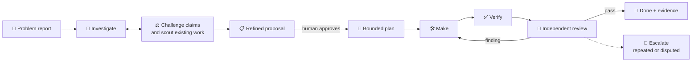
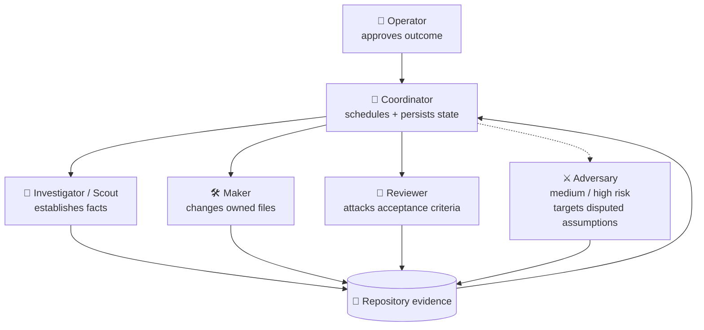
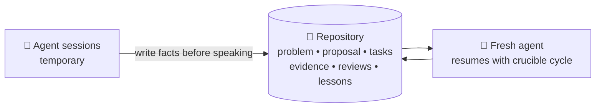

<p align="center">
  
</p>

<h1 align="center">Crucible</h1>

<p align="center">
  <strong>Turn a problem report into reviewed, verified work—without letting agents skip from allegation to implementation.</strong>
</p>

<p align="center">
  <a href="https://github.com/medhatgalal/crucible/releases/latest"></a>
  <a href="https://github.com/medhatgalal/crucible/actions/workflows/selftest.yml"></a>
  <a href="LICENSE"></a>
</p>

Crucible is a file-backed workflow for coordinating one or many coding agents. A fresh agent learns the
protocol from the repository, investigates whether a reported problem is real, proposes only the work
supported by evidence, waits for human approval, and iterates implementation and review until the
approved outcome is demonstrably done.

No daemon. No database. No package manager. No permanent agent memory. Just POSIX shell, Git, Markdown,
and evidence that survives the chat which produced it.

## 🔥 Start with one prompt

Open the repository you want to change, then give a fresh agent either source for Crucible.

**Read from the public web:**

> Read `https://raw.githubusercontent.com/medhatgalal/crucible/main/BOOTSTRAP.md`. You are already in
> the target repository. Run a complete Crucible cycle for this problem: `<problem or report path>`.

**Read from a local checkout or extracted release:**

> Read `/absolute/path/to/crucible/BOOTSTRAP.md`. You are already in the target repository. Run a
> complete Crucible cycle for this problem: `<problem or report path>`.

The agent obtains Crucible, verifies its cold-start contract, installs a guided cycle into the target
repository, proposes the smallest useful agent/persona panel, and returns one evidence-grounded proposal
for approval. The operator does not drive lifecycle commands.

Already installed? Say:

> Read `.crucible/<program>/START.md` and continue this cycle.

## ✨ The value

| Common agent failure | Crucible response |
| --- | --- |
| A problem report is treated as truth | Split it into atomic claims and independently fact-check each one |
| Work already exists or the report is stale | Scout current behavior before creating backlog work |
| Planning quietly becomes implementation | Bind explicit human approval to the exact proposal content |
| An agent reviews its own framing | Separate maker and reviewer inputs, identities, and evidence |
| Reviews repeat expensive checks forever | Reuse unchanged evidence, bound retries, and escalate repeated findings |
| A session ends and the reasoning disappears | Preserve the problem, proposal, work, reviews, and evidence in Git-backed files |
| “Done” means an agent said so | Refuse closure until current evidence covers the approved outcome |

## 🔁 One problem-to-done loop



Before approval, agents may investigate, falsify, narrow, and propose—but not build. After approval,
only bounded work enters the make → verify → review → fix loop. `DONE` requires current evidence for
the integrated work, not a clean diff or an agent self-report.

## 🧭 Multi-agent orchestration without agent theatre

Crucible coordinates responsibilities, not vendors. It can use built-in subagents, external agent CLIs,
one model class in isolated contexts, or several model families. The panel grows only when the risk
justifies it.



| Role | Responsibility | Boundary |
| --- | --- | --- |
| 🧭 Coordinator | Schedules, synthesizes, and persists decisions | Does not silently implement and judge |
| 🔎 Investigator / Scout | Tests the report and searches existing behavior | Does not manufacture backlog from allegations |
| 🛠️ Maker | Implements one approved, owned task | Changes only assigned paths |
| 🧪 Reviewer | Independently tests the acceptance contract | Receives evidence, not maker rationale |
| ⚔️ Adversary | Falsifies medium/high-risk or disputed work | Invoked selectively, not as ceremony |

The same model may fill several roles in fresh isolated contexts; Crucible labels that a
**same-family review** because correlated blind spots remain. Behavioral, security, data, migration,
irreversible, or repeatedly disputed work should use a different model family when available.

## 💾 The agent can disappear; the work cannot



Machine-specific agent commands, live contexts, processes, and isolated worktrees are disposable.
The approved decisions and proof remain in the target repository. Cleanup is previewed exactly and
requires approval; it preserves durable work evidence.

## 🛡️ What is actually enforced

The shell refuses missing or stale evidence, stale work IDs, maker self-review, unregistered reviewers,
mutable managed results, unsupported lifecycle transitions, unapproved work admission, unsafe task
ownership, duplicate expensive checks on unchanged work, and unsupported closure.

Crucible is not a security boundary. Under one operating-system user, it cannot cryptographically prove
who authored a file or that a passing test meaningfully tests the intended behavior. It labels those
limits honestly and uses isolated context, discriminating falsifiers, and selective cross-family review
as risk controls—not as pretend guarantees. See [SECURITY.md](SECURITY.md) and [RULES.md](RULES.md).

## 📚 Go deeper

- [START.md](START.md) — self-contained fresh-agent operating prompt
- [LOOP.md](LOOP.md) — lifecycle behavior and exit criteria
- [CONFIGURE.md](CONFIGURE.md) — agents, models, personas, and risk posture
- [RULES.md](RULES.md) — enforced checks versus instructional rules
- [Managed lifecycle protocol](docs/managed-lifecycle.md) — low-level agent-facing commands
- [CONTRIBUTING.md](CONTRIBUTING.md) — development constraints and verification
- [RELEASE.md](RELEASE.md) — deterministic package and release procedure

<details>
<summary><strong>Maintainer verification</strong></summary>

```sh
./scripts/selftest.sh --fast
./scripts/verify-agent-cycle.sh
./scripts/verify-package.sh
```

</details>

MIT licensed. See [LICENSE](LICENSE).
