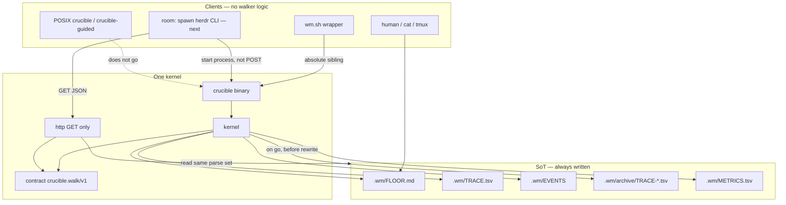

# ADR 0001: Rust operating layer

- **Date:** 2026-09-21
- **Status:** Accepted
- **Product VERSION:** 1.17.0 (cut-over already shipped). This ADR does not bump `VERSION`.

Crucible is the operating layer for other git repos: adopt into a product tree, then worker CLIs run `/crucible` intake and `go` until `CLOSED` / `STOP-ASK` / `ESCALATE`.

One Rust architecture, one walker. Versioned contracts (`crucible.walk/v1`) and a GET-only HTTP surface make CLI, later herdr-crucible room, later web, and tmux **clients of the same snapshot**. Files remain the source of truth: a human can `cat .wm/FLOOR.md` with no daemon.

This ADR freezes D1–D22. Living spec is `crates/contract` tests, verify-working-mode-* on the shipped `crucible` binary, and CLI=HTTP equality CHECKs. Do not store campaign design under `docs/` or `docs/superpowers/specs/`.

## Current tree (main)

Honest snapshot of this repo after **1.17.0** (Rust working-mode cut-over) and the post-tag GET serve:

| Piece | On main now |
| --- | --- |
| Kernel | Rust (`crates/kernel`). Not POSIX `floor_write`. |
| Product binary | Cargo `[[bin]]` name **`crucible`** (`crates/cli`). **No `wm` binary.** |
| Wrapper | Repo-root `wm.sh`: export `WM_WRAPPER=$0` then `exec "$bindir/crucible" "$@"`. Not a second kernel. Do not dump it. |
| Guided POSIX | Repo-root `./crucible` is still adopt/cycle/drive. Release tarball copies that script to `crucible-guided` then installs the Rust binary as `crucible`. |
| HTTP | `crucible serve`: GET `/walk` `/stats?since=` `/health`. Loopback only. **No `POST /go`.** |
| Room | Landed: `crucible room` (require herdr; spawn this binary `serve`; standing roles). Help lists `room` and `doctor`. |
| Doctor | `crucible doctor` warns if home `~/.grok/rules/loop-router.md` is missing or stale vs ADR-HASH (`testdata/loop-router.md`; D8/D15). Never `$HOME` in CI. |
| Web | Not in the v1 workspace. |
| WAL | Kernel writes `.wm/EVENTS` (JSONL, no `.jsonl` suffix). |
| Stats | `crucible.stats/v1` still reads `.wm/METRICS.tsv` (`source: "metrics"`). Prefer EVENTS when present is remaining, not a silent lie. |
| Human `status` | `status --json` is read-only. Bare `status` is not a write in this binary yet (D20 still holds). |

Non-goals of this ADR PR: do not implement kernel, do not dump `wm.sh`, do not bump `VERSION`.

## PATH layout (D18)

| Role | Name | Where |
| --- | --- | --- |
| Working-mode **kernel binary** | **`crucible`** | Engine tarball root; copied to `.crucible/work/crucible` |
| Guided **POSIX entry** | **`./crucible`** in the engine git tree; **`crucible-guided`** in the release tarball | `adopt` / `cycle` / `drive` / `help`. Not the walker. |
| Wrapper | **`wm.sh`** | `WM_WRAPPER=$0`; `exec` absolute sibling `crucible`. Copied to `.crucible/<program>/wm.sh`. |
| `exec` target | Absolute path **next to the wrapper** | Never a bare `crucible` or `wm` on `PATH` |

Operator inner loop stays `.crucible/work/wm.sh go`. `~/.local/bin/crucible` as the **walker** is rejected (collides with POSIX adopt). Room and `serve` spawn `std::env::current_exe()` or `"$bindir/crucible"`, never PATH `crucible`.

Wrapper (the only shipped walker `.sh`; not `exec -a`):

```sh
#!/bin/sh
set -eu
bindir=$(CDPATH=; cd -- "$(dirname -- "$0")" && pwd)
WM_WRAPPER=$0; export WM_WRAPPER
exec "$bindir/crucible" "$@"
```

Help may use `WM_WRAPPER` when set so greps still see `run: .crucible/<prog>/wm.sh go`.

## Crate map (v1 — no `web`)

```text
crates/
  contract/   # snapshot, events, parse/emit files — no I/O servers
  kernel/     # go, run, independence, FLOOR/TRACE/EVENTS writers
  cli/        # argv → kernel/contract (the `crucible` binary)
  http/       # GET server, same types as cli
  room/       # NEXT: spawn external herdr + GET cameras + spawn go
wm.sh         # WM_WRAPPER; exec "$bindir/crucible"
crucible      # POSIX adopt/cycle/drive (engine tree)
architecture/adr/   # landed decisions only
architecture/wip/   # gitignored; not source
```

No `wrappers/` directory. No `crates/web` until a later web PR. ADR 0001 does **not** list `web` as a required crate.

**Dependency rule:** `contract` has no servers. `kernel` depends on `contract` only. `http` and `cli` depend on `contract` (`cli` also on `kernel` / `http` for verbs that mutate or serve). `room` depends on process spawn + HTTP client — **not** on `kernel` internals and **not** on a Herdr crate. `crates/kernel` and `crates/contract` MUST NOT import Herdr, Grok, or EngOS types. Default musl features: **zero** Herdr crates in the whole `crucible` tree.



## Frozen decisions (D1–D22)

D1–D17 from the approved plan. D18–D22 freeze review holes. D18/D19 are the **operator overrides** as landed: product binary is `crucible`, not `wm`; `wm.sh` remains an exec wrapper (not dumped).

| ID | Decision |
| --- | --- |
| D1 | Keep this repo. Do not retire it. Room is a **crate in this repo**, not a second kernel repo. |
| D2 | **Rust is the only kernel.** No mixed “sh writes / rust reads” product mode. No long compat dual-walker. |
| D3 | **`.sh` is wrappers only:** export `WM_WRAPPER=$0` then `exec` the versioned **`crucible`** binary by **absolute sibling path** (never `exec -a`). No card logic, no FLOOR writes, no TRACE in shell. |
| D4 | Release: **versioned static `crucible`** in GitHub/GitLab release + tarball (`dist/crucible-$VERSION.tar.gz`). `adopt --refresh` installs **that** binary plus POSIX guided entry. Product machines need **no rustc**. Contributors: cargo + rustfmt + clippy. |
| D5 | v1 walker = **working-mode** only. Guided `cycle`/`drive` later, **same** snapshot schema. |
| D6 | Superpowers is **not** a dependency. EngOS is **not** in the walk. |
| D7 | Grok slash is **not** inside a walk unless the user **interrupts**. Workers = harness CLIs Crucible starts. |
| D8 | **Signal:** `/crucible` or live walk → Crucible. Named other framework → that. Else → Grok-native + `NEXT:`. Interrupt wins until `/crucible`/`go` again. |
| D9 | Contracts: `crucible.walk/v1` + events WAL + **panel-as-files** (cast state `go` already requires; **not** a `WalkSnapshot` key in v1). CLI **read-only** JSON **equals** HTTP JSON. Files always written (human/`cat` without HTTP). |
| D10 | Kernel HTTP: **GET** `/walk` `/stats?since=` `/health`. **No `POST /go`.** Room starts `go` as a **process**, not an HTTP walk. |
| D11 | **herdr-crucible is required** (next crate). `crucible room` in a product repo: start kernel serve if needed, start Herdr **structured tabs/roles** (chat, orchestrator, watcher, reaper, dashboard), cameras **GET** the API. Kernel crate has **zero** Herdr types. Room talks **external `herdr` + kernel HTTP**. Not a fork of herdr-init; **recreate** the concept. |
| D12 | Core-Prompts shaping: **Grok-side** for designing this work. Not in the binary v1. Later optional menu `shaping: off \| grok`. |
| D13 | Blank-HOME CHECKs pass on the **shipped `crucible` binary**. |
| D14 | Identity: static `crucible` + POSIX guided entry + files + cargo for contributors. CHANGELOG 1.17.0 records the break from “POSIX sh is the **working-mode** engine.” |
| D15 | **Grok router is required** (home `~/.grok/rules/loop-router.md`). Keep-current: doctor warn + optional `/loop` + **engine CI on `testdata/loop-router.md` vs this ADR** (never `$HOME` in CI). Must **not** force `/execute-plan` inside `/crucible`. |
| D16 | **No plans in `docs/`.** Operator how-to stays `WORKING-MODE.md` / `docs/working-mode.md`. Campaign design lands as **one ADR**. Campaign WIP stays gitignored under `architecture/wip/`. Rotting `docs/superpowers/plans/` deleted. |
| D17 | Web is a **client of GET JSON**, not a second kernel. **Not in the v1 workspace.** Later: kernel HTTP → room cameras and/or a small web UI crate. No walker logic in the UI. |
| D18 | **Operator override:** one Rust product binary named **`crucible`**. Keep **concepts** (`adopt`, `go`, `status`, `debrief`, `stats`, `serve`, `room`, `doctor`). No `wm` binary. `wm.sh` stays the exec wrapper (absolute sibling). Engine-tree POSIX `./crucible` is not overwritten by `cargo build`; the tarball installs Rust `crucible` beside `crucible-guided`. |
| D19 | v1 Rust owns working-mode + `serve`. Guided `cycle`/`drive` (and `adopt`/`refresh` on the POSIX entry) stay on `./crucible` / `crucible-guided` until a later tag, same schema. `room` is the next crate. |
| D20 | Human `status` may write; `status --json` and GET `/walk` are **read-only**. HTTP never writes. |
| D21 | Herdr is an **external process** (`herdr` on PATH). Default musl `crucible` has **zero** Herdr crates. |
| D22 | WAL path is **`.wm/EVENTS`** (JSONL, no `.jsonl` suffix). |

### Key decisions (why / rejected)

| ID | Why | Rejected |
| --- | --- | --- |
| D1 | One VERSION, one adopt, one golden suite | New kernel/room repo |
| D2 | Two walkers diverge; dual clock | Mixed sh-write / rust-read product |
| D3 | Shell is not a second kernel; `$0` help survives exec; PATH-safe | Bare `exec crucible`; `exec -a`; thin-but-still-writes wrappers |
| D4 | Product machines have no rustc | “Build from source on the laptop” |
| D5 | Guided cycle is a different envelope | Port `drive` in the same tag |
| D6 | Wrong loop | Skill-runtime dependency |
| D7 | Workers are harness CLIs Crucible starts | Nested `/implement` in `go` |
| D8 | Chat stays free; interrupt wins | Always-on Grok DAG inside `/crucible` |
| D9 | One language; `cat` works | Scrape Markdown; daemon-required board; panel JSON key |
| D10 | Dual clock; tty/brakes are a process | Dashboard-started walks (`POST /go`) |
| D11 | First-class cameras; recreate not fork | Optional tmux; copy herdr-init |
| D12 | Not a binary feature | `shaping` menu in kernel now |
| D13 | Cold-start contract | CHECKs that need cargo/rustc |
| D14 | Honest identity | Quiet dual identity |
| D15 | Phrase map rots otherwise | Router as product walker; CI reads `$HOME` |
| D16 | Rotting `docs/superpowers/plans/` | Design dumps next to how-to |
| D17 | No second SoT; no extra crate on day one | Walker logic in UI; `web` in this ADR |
| D18 | One product name; POSIX adopt must not collide | A `wm` kernel binary; dumping `wm.sh` while docs still say `wm.sh go` |
| D19 | Guided porcelain stays POSIX until a later tag | Rust `adopt` / retire POSIX entry in v1 |
| D20 | CLI=HTTP CHECK is coherent | HTTP writes; `--json` appends TRACE |
| D21 | Static binary; kernel stays clean | Link Herdr into `crucible` |
| D22 | Pin golden path | `.wm/EVENTS.jsonl`; implementer choice |

## Signal (D8)

Not inside the kernel.

| Mode | Signal | Next-step hints |
| --- | --- | --- |
| Crucible | `/crucible` or FLOOR/`go` live | FLOOR, STOP-ASK, `wm.sh status` |
| Other | User named EngOS / herdr-init / … | That porcelain |
| Grok-native | Neither | Phrase map + `NEXT:` + Enter-to-send |

Interrupt wins until `/crucible` / `go` again. Grok slash is **not** inside a walk unless the user interrupts.

## Contract

Published language: **`crucible.walk/v1`**. Canonical JSON: UTF-8, sorted object keys, no insignificant whitespace in the equality CHECK (pretty-print is a **flag**, not the contract). **Pretty vs canonical is the only allowed CLI/HTTP delta.** Omit `elapsed_s` from canonical equality (inject `Clock`).

### Read vs write (D20)

| Verb | Mutates board? |
| --- | --- |
| `crucible status` (human, no `--json`) | **Yes** — next card; append TRACE if card changed. Does not increment FAIL retries. |
| `crucible status --json` | **No** — `WalkSnapshot::from_wm_dir` only. |
| GET `/walk` | **No** — same parser. |
| `crucible go` / station verbs | **Yes** — kernel writers. |

Equality CHECK: `crucible status --json` ≡ GET `/walk` ≡ `WalkSnapshot::from_wm_dir`. **Do not** compare human `status` (write) to GET.

`available` is a **boolean only**. Missing `.wm`, empty `.wm`, or unreadable FLOOR → `available: false` and null fields. Readable FLOOR without `t0` → `available: true`, `t0_unix`/`elapsed_s` null (do not compute `clock - 0`). Fake-fail: `available: true` without a readable FLOOR after `go` has started (`t0` or TRACE data exist).

**Panel (D9):** not a JSON key. Panel means the **cast files** `go` already requires. v1 snapshot does not embed them.

`WalkSnapshot::from_wm_dir` reads only `.wm/FLOOR.md`, `.wm/TRACE.tsv`, `.wm/CLOSED`, `.wm/t0`, `.wm/FALSIFIER`, `reviews/review.md`, `.wm/evidence/*` (regular files). JSON evidence paths are **repo-relative**.

### Stats (`crucible.stats/v1`)

`since` is RFC3339 Zulu or duration `Ns`/`Nm`/`Nh`/`Nd`. GET `/stats?since=` uses the same JSON as `crucible stats --since --json`. Missing source → `available: false`, empty `halts`, zero counts — **do not invent rows**. Current parser source is `"metrics"` (`.wm/METRICS.tsv`). After EVENTS is the stats source: `"events"` if `.wm/EVENTS` exists, else `"metrics"`.

### Events WAL (D22)

Append-only JSONL at **`.wm/EVENTS`**. Kernel is the only writer. Binding kinds: `card`, `invoke_end`, `halt`. Extra walker bookkeeping kinds (`walk_start`, `lesson`) are allowed; they do not replace the binding three.

### HTTP (`crucible serve`) — no `POST /go`

Bind **loopback only**. Default `127.0.0.1:1734`. `--bind` may change the **port** on `127.0.0.1` or `[::1]`. **Non-loopback (`0.0.0.0`, LAN, public) is refused:** process **does not listen**, exit nonzero. Not a warn.

| Method | Path | Body |
| --- | --- | --- |
| GET | `/walk` | `WalkSnapshot` (read-only parse) |
| GET | `/stats?since=` | `StatsWindow` |
| GET | `/health` | `{ "ok": true, "version": "<semver>", "bind": "127.0.0.1:1734" }` — process liveness, not walk success |
| **forbidden** | **`POST /go`** | **Must 404/405.** Fake-fail of HTTP. |

Loopback GET is **equivalent to reading `.wm`**, not an auth boundary (`SECURITY.md`). `go` is a **foreground OS process**. Room may spawn that process in a tab. HTTP never starts a walk and never writes FLOOR/TRACE.

Second server: probe GET `/health` first. If `ok: true` and `version` matches, do not start another listener. If the port is busy with a non-health or wrong version, **fail** (no `SO_REUSEPORT`).

## Files

| Path | Writer | Lifetime |
| --- | --- | --- |
| `.wm/FLOOR.md` | kernel (human `status`, `go`, station) | Current board. Not written by `--json` or GET. |
| `.wm/TRACE.tsv` | kernel | **This run.** Header `when\tcard\toutcome`. |
| `.wm/archive/TRACE-<t0>-<iso>.tsv` | kernel | Previous TRACE copied **before** `go` rewrite. Fake-fail: rewrite without archive. |
| `.wm/EVENTS` | kernel | Append-only WAL JSONL (D22). |
| `.wm/METRICS.tsv` | kernel | Halt rows. |
| `.wm/CLOSED` | kernel | Work-level close. |
| `.wm/t0` | kernel | Unix seconds; reset on each `go`. |

## Room (required, next)

`crucible room` (product cwd). Herdr = external process (D21). Default musl links **no** Herdr crate. Missing `herdr` (and unset/unusable `CRUCIBLE_HERDR`): exit **nonzero**, print a refusal, **do not** invent TRACE, **do not** listen.

Sequence:

1. GET `/health` on configured loopback bind. If not ok, spawn **`current_exe() serve`**. If port busy with a stranger, **fail**.
2. Spawn Herdr with structured tabs: **chat**, **orchestrator**, **watcher** (GET only; must not write the go PTY), **reaper** (kill `go` process group), **dashboard**.
3. Standing labels; second attach does not duplicate tabs.
4. Spawn **`current_exe() go`** in orchestrator **only if** `IDEA.md` is non-empty **or** a READY `BACKLOG.tsv` row exists. Else wait for chat.
5. Missing FLOOR → snapshot `available: false`. Cameras are GET clients.

Fake-fail: copy herdr-init; Herdr types in kernel/contract; Herdr crate on default musl; auto-go via `POST /go`; watcher writes to the go PTY; spawn PATH `crucible`; missing herdr still listens or writes TRACE.

`examples/tmuxinator-crucible.yml` remains optional layout, not a substitute.

## Packaging

Local filename stays **`crucible-$VERSION.tar.gz`** with prefix **`crucible-$VERSION/`**. Contents: host-platform `crucible` binary + `wm.sh` wrapper + POSIX `crucible-guided` + skills. Product machines: **no rustc**. CI may rename the upload to a platform-qualified asset; local CHECKs use the unplatformed name.

This ADR does not change `package-release.sh`.

## Alternatives considered

All rejected. Do not reopen without a new ADR.

| Alt | Rejected because |
| --- | --- |
| A1 Mixed sh/rust kernel | D2, D3. No mixed-mode **RELEASE**. |
| A2 New repo for kernel or room | D1 |
| A3 Optional room / “tmux is enough” | D11 |
| A4 `POST /go` | D10 |
| A5 Superpowers / EngOS / Core-Prompts in the binary | D6, D12 |
| A6 Kernel binary named `wm` | D18 operator override: product binary is `crucible` |
| A7 Rust grows `adopt` / retire POSIX guided in v1 | D5, D19 |
| A8 GET `/walk` or `status --json` writes | D20 |
| A9 Herdr crate linked into default musl `crucible` | D21 |
| A10 Dump `wm.sh` on cut-over | Operator inner loop and verify greps still name `.crucible/work/wm.sh go`. Wrapper stays. |

## Remaining (not this ADR)

- stats from EVENTS when present; human `status` write in the Rust argv (D20).
- CONTRIBUTING still states a POSIX-only identity; CHANGELOG 1.17.0 already records the kernel break.
- Do not bump `VERSION` on this PR.
