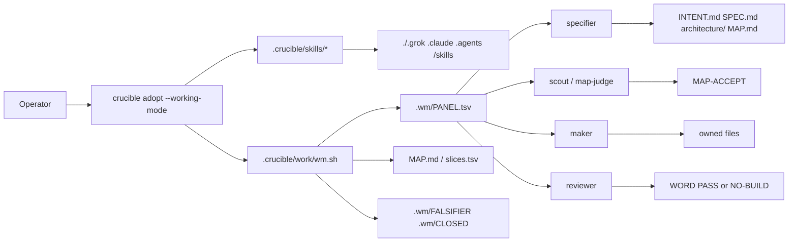
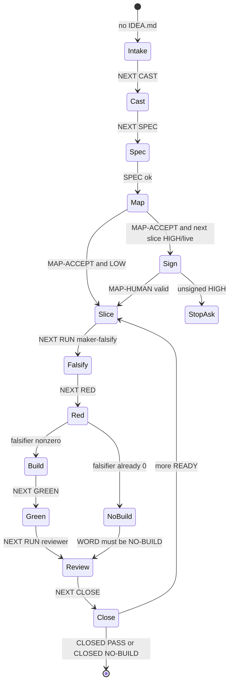

# Working-mode (opt-in)

On **1.14.1**, default adopt is still the guided cycle (1.6.6 **layout**): no
`wm.sh` unless `--working-mode`. Working-mode is a second runner (`wm.sh`) plus
swap-out batteries. Overlay a judging battery under `.crucible/skills/<bat>/`
to change FAIL cap or MAP-REVISE card (`## Send-back` TSV) without editing
`wm.sh`. Brownfield `check-module-fit` / `map-ready` will not mkdir a new
`src/<name>`, `packages/<name>`, or `cmd/<name>` unless `QUESTIONS.md` and
`ANSWERS.md` are both non-empty; greenfield still mkdir. `map-ready`
requires `INTENT.md` headings `## User` / `## Job` / `## Non-goals`.
Named `test_entrypoint` must exist; `wm green` extra-proof hides it and
requires the FALSIFIER to fail. CLOSE writes `reviews/taste.md`. Live walk
proceeds with one kind as `SUBAGENT-ISOLATED`; two kinds stay
`CROSS-FAMILY`; zero is still `INDEPENDENCE_UNAVAILABLE`. Install with
`crucible adopt PROGRAM --managed --working-mode`.
Forgot the command: `.crucible/work/wm.sh` (no args) then `go [IDEA.md]`
or `status`. Runtime is the target repo plus one harness CLI. Skills live
in the repo (`.crucible/skills/` and harness views). There is no `$HOME`
skill runtime.

From the **target repository root**, invoke `.crucible/<program>/wm.sh` (not a
bare `wm` on `PATH`). After `adopt work --managed --working-mode`, `<program>`
is `work`.

## Quickstart

Install from Crucible source `$SRC` into an empty **target** git repo (cwd =
target root). Default adopt still has no `wm.sh`; this is opt-in:

```sh
SRC=/path/to/crucible
DST=$(mktemp -d)
git -C "$DST" init -b main
cd "$DST"
"$SRC/crucible" adopt work --managed --working-mode
printf '%s\n' "product/hello.txt contains exactly hello" > IDEA.md
.crucible/work/wm.sh go
```

Forgot the command? Run `.crucible/work/wm.sh` with no args (help), then `go`
or `status`. Runtime is `.crucible/work/wm.sh` from that target root (not a
bare `wm` on `PATH`). Mapper, maker, and reviewer must be distinct agents.
`{BRIEF}` is quoted by the engine — do not wrap it in quotes in the command.
Stop on `CLOSED PASS`, `CLOSED NO-BUILD`, `STOP-ASK`, or `ESCALATE`. Do not
background-wait. `go` discovers grok/kiro-cli/codex when the panel is empty.
Zero CLIs is `INDEPENDENCE_UNAVAILABLE` (it will not invent echo fixtures).
One kind live walk is `SUBAGENT-ISOLATED`; two kinds is `CROSS-FAMILY`.

Advanced copy-paste (fixtures, HIGH sign, specifier+scout) stays below.

### Example A — LOW fixture walk (copy-paste)

Checked-in files live in `docs/examples/working-mode/` (one LOW slice:
`product/hello.txt` is exactly `hello`). Copy them, cast fixture workers,
accept the map, and run one foreground loop. LOW local maps do not need
`MAP-HUMAN`. Mapper is `alice` via `MAP.md` / `record-mapper --from MAP.md`
(there is no `cast mapper` verb). Critique is `bob` via a `MAP-ACCEPT`
return file. Maker `carol` ≠ reviewer `dave`.

```sh
cp -R "$SRC/docs/examples/working-mode/." .
.crucible/work/wm.sh init
.crucible/work/wm.sh cast coordinator parent grok -
.crucible/work/wm.sh cast maker carol grok './tools/maker.sh {BRIEF}'
.crucible/work/wm.sh cast reviewer dave grok './tools/reviewer.sh {BRIEF}'
.crucible/work/wm.sh record-mapper --from MAP.md
.crucible/work/wm.sh map-ready
mkdir -p .wm/return
printf 'WORD: MAP-ACCEPT\nAGENT: bob\nMAP: MAP.md\n' > .wm/return/bob.md
.crucible/work/wm.sh map-verdict .wm/return/bob.md
.crucible/work/wm.sh loop
```

`loop` ends `CLOSED PASS`. `product/hello.txt` contains `hello`.
`MAP-ACCEPT` is not `CLOSED PASS`.

### Example B — HIGH next slice needs a sign

A HIGH `MAP.md` row (`MAP-HUMAN` required; two kinds is CROSS-FAMILY,
one kind is SUBAGENT-ISOLATED — never fake CROSS-FAMILY):

```
s1	product	product/hello.txt	-	HIGH
```

Cast maker `carol` grok and reviewer `dave` kiro:

```sh
.crucible/work/wm.sh cast maker carol grok './tools/maker.sh {BRIEF}'
.crucible/work/wm.sh cast reviewer dave kiro './tools/reviewer.sh {BRIEF}'
```

Unsigned `.crucible/work/wm.sh loop` prints `STOP-ASK MAP-HUMAN` and does
not start the maker. Then:

```sh
hash=$( (sha256sum MAP.md 2>/dev/null || shasum -a 256 MAP.md) | awk '{print $1}' )
printf 'SIGNED: operator\nMAP: MAP.md\nSHA256: %s\n' "$hash" > MAP-HUMAN
.crucible/work/wm.sh loop
```

`SIGNED:` must be a human id — not mapper, maker, reviewer, parent,
coordinator, or loop. A rewrite of `MAP.md` after sign is not a sign.

### Example C — vague IDEA, specifier+scout cast

A vague `IDEA.md` with no hand-written SPEC/MAP. Cast specifier and scout
with real CLIs (not `-`). Specifier `eve` writes `INTENT.md`, `SPEC.md`,
`architecture/modules.md`, and `MAP.md` (`MAPPER: eve`). Scout `bob` ≠
`eve` returns `MAP-ACCEPT`. Maker `carol` ≠ reviewer `dave`. Without those
CLIs, `loop` is still `STOP-ASK NEXT SPEC` / `STOP-ASK NEXT MAP`.

```sh
cp "$SRC/docs/examples/working-mode/IDEA.md" .
mkdir -p tools
cp "$SRC/docs/examples/working-mode/tools/"*.sh tools/
chmod +x tools/*.sh
.crucible/work/wm.sh init
.crucible/work/wm.sh cast coordinator parent grok -
.crucible/work/wm.sh cast specifier eve grok './tools/specifier.sh {BRIEF}'
.crucible/work/wm.sh cast scout bob grok './tools/scout.sh {BRIEF}'
.crucible/work/wm.sh cast maker carol grok './tools/maker.sh {BRIEF}'
.crucible/work/wm.sh cast reviewer dave grok './tools/reviewer.sh {BRIEF}'
.crucible/work/wm.sh loop
```

`loop` ends `CLOSED PASS`. `product/hello.txt` contains `hello`. Specifier
does not write a brick WORD. `MAP-ACCEPT` is not `CLOSED PASS`.

### Prove it

Kernel CHECKs from the **Crucible source** tree (empty HOME):

```sh
HOME=$(mktemp -d) scripts/verify-working-mode.sh
```

Extra proof that Example A still matches `docs/examples/working-mode/`
(same extra-proof shape as `scripts/verify-working-mode-blank-home.sh`;
not a CI gate; map CHECKs are `scripts/verify-working-mode-map.sh` on CI):

```sh
HOME=$(mktemp -d) scripts/verify-working-mode-quickstart.sh
```

Brick CHECKs (maker ≠ judge, observed-red, NO-BUILD, live fence) live in
`wm.sh` and `scripts/verify-working-mode.sh`. Refresh the engine only from
a **newer** tree (`adopt work --refresh`); `src == dst` is refused.

## Use cases you can run today

| You have | You do | System does | You cannot yet |
| --- | --- | --- | --- |
| Empty git repo | `adopt work --managed` | Guided cycle only | Working-mode (`wm.sh` absent) |
| Empty git repo | `adopt work --managed --working-mode` | Copies `wm.sh`, four batteries, skill views | Default-on working-mode (1c) |
| Hand-written LOW map | Example A | One `loop` → `CLOSED PASS` | — |
| Vague `IDEA.md` | Example C (specifier+scout+maker+reviewer cast) | SPEC+MAP then brick → `CLOSED PASS` | Inventing a map with no specifier CLI |
| Product already matches the falsifier | Example A files + existing hello | `CLOSED NO-BUILD` | Reviewer PASS on a no-build red |
| HIGH slice | Example B + `MAP-HUMAN` | Stops until you sign; then walks | Unattended HIGH/live (8c) |
| Several modules | `MAP.md` with `depends_on` | One `loop` walks READY parents-CLOSED | Parallel in-slice TASKS |
| Live Grok/Kiro/Codex | `scripts/verify-working-mode-live.sh` | Fail-closed if none of grok/kiro-cli/codex can auth; kiro uses host HOME (keychain); one kind `SUBAGENT-ISOLATED`; two kinds `CROSS-FAMILY` | Empty-HOME kiro hang labelled unauthenticated; claiming independence when those CLIs are missing |
| Guided stall (`WAIT APPROVAL`) | Stay on `crucible drive` | Unchanged 1.6.6 gates | Working-mode will not clear those gates |

## Visuals

Who talks to whom after `--working-mode` (target repo root):



Example C — vague IDEA, workers cast, LOW (no `MAP-HUMAN`):

```mermaid
sequenceDiagram
  participant Op as Operator
  participant Wm as wm.sh loop
  participant Sp as specifier
  participant Sc as scout
  participant Mk as maker
  participant Rv as reviewer
  Op->>Wm: adopt --working-mode; cast; loop
  Wm->>Wm: next NEXT SPEC
  Wm->>Sp: run specifier
  Sp-->>Wm: SPEC.md modules.md MAP.md
  Wm->>Wm: next NEXT MAP; map-ready
  Wm->>Sc: run scout
  Sc-->>Wm: WORD MAP-ACCEPT
  Wm->>Wm: map-verdict; NEXT SLICE s1
  Wm->>Mk: run maker-falsify
  Mk-->>Wm: FALSIFIER
  Wm->>Wm: red (missing product)
  Wm->>Mk: run maker-build
  Mk-->>Wm: product commit
  Wm->>Wm: built; green
  Wm->>Rv: run reviewer
  Rv-->>Wm: WORD PASS + evidence
  Wm->>Wm: close; CLOSED PASS
```

Brick states the walker consumes (one slice):



## Map cadence (6b)

Architecture names Plane A (`architecture/modules.md`) and cuts Plane B slices
that fit those module roots (`MAP.md`). Critique attacks the map. The kernel
materializes `slices.tsv` and will not start a maker until the map is accepted.
Brownfield `check-module-fit` / `map-ready` will not mkdir a new `src/<name>`,
`packages/<name>`, or `cmd/<name>` unless `QUESTIONS.md` and `ANSWERS.md` are
both non-empty. Greenfield still mkdir.

```
id	module	owned_paths	depends_on	risk	status
s1	widget	src/widget/api.py	-	LOW	READY
```

Risk is `LOW` or `HIGH`. Status is `PENDING` (after
`.crucible/<program>/wm.sh map-ready`), `READY` (after `MAP-ACCEPT`), `REVISE`,
or `STOP-ASK`.

| Step | Who | Command / word |
| --- | --- | --- |
| Inventory + slices | architecture battery (mapper) | write `MAP.md`; `.crucible/<program>/wm.sh record-mapper --from MAP.md`; `.crucible/<program>/wm.sh map-ready` |
| Attack the map | critique battery (map-judge) | invert + adversarial + simple; return `MAP-ACCEPT` \| `MAP-REVISE` \| `MAP-STOP-ASK` |
| Ingest | kernel | `.crucible/<program>/wm.sh map-verdict RETURNFILE` (calls `.crucible/<program>/wm.sh check-map-word` and, on ACCEPT, `.crucible/<program>/wm.sh check-module-fit`) |
| Human sign | operator | `MAP-HUMAN` when the **next READY** slice is HIGH or `live_write=yes` (8c) |
| First slice | kernel | `.crucible/<program>/wm.sh next` → `NEXT SLICE <id>` for the first READY row |
| Brick | maker / reviewer | existing small loop (`.crucible/<program>/wm.sh run maker-falsify` … `.crucible/<program>/wm.sh close`) |

`MAP-ACCEPT` is not `CLOSED PASS`. Map closer ≠ brick closer. Mapper id cannot
be the maker. Architecture author id cannot be the critique author.

`.crucible/<program>/wm.sh loop` is a foreground walker (no `&`, no daemon).
One `loop` walks remaining READY slices whose `depends_on` parents are CLOSED,
resets brick receipts between slices, and writes work-level `.wm/CLOSED` only
when none remain. HIGH unsigned is `STOP-ASK MAP-HUMAN` (A4). When specifier
and scout are cast with a real CLI (not `-`), `NEXT SPEC` runs specifier and
`NEXT MAP` runs map-ready plus scout map-judge; without those CLIs those
cards stay `STOP-ASK`. Specifier cannot be maker. Scout cannot `MAP-ACCEPT`
a map it authored. `LOOP_BOUND` is max(40, min(240, 16+12×slices)).
`.crucible/<program>/wm.sh run` returns the worker exit status after
judge/WORD checks. Live / destroy / push-main remain STOP-ASK (2c).

## Human sign (8c)

The kernel is **next-slice** scoped. After `MAP-ACCEPT`, sign when the
**next READY** slice is HIGH or its module `live_write` is `yes`. A LOW
prefix may walk without `MAP-HUMAN`. HIGH unsigned is
`STOP-ASK MAP-HUMAN` (A4). Write `MAP-HUMAN` at repo root before
`.crucible/<program>/wm.sh run maker-falsify` on that HIGH/live slice.
LOW local maps do not need it. This is a human gate after the map-judge
(8c), not a replacement for critique and not a dummy file. Keep the
SHA256 bind: a rewrite of `MAP.md` after sign is not a sign.

`.crucible/<program>/wm.sh` parses the same `key: value` shape as return files.
`SIGNED:` must be a non-empty human id — not mapper, maker, reviewer, parent,
coordinator, or loop. `MAP:` must name an existing map file (`MAP.md`).
`SHA256:` (or `MAP-SHA256:`) must equal the current `file_sha256` of that
file. A rewrite of `MAP.md` after sign is not a sign. A token such as `x`
is not a sign.

```
SIGNED: operator
MAP: MAP.md
SHA256: <sha256 of MAP.md>
```

Without a valid `MAP-HUMAN` on HIGH/live,
`.crucible/<program>/wm.sh run maker-falsify` refuses and
`.crucible/<program>/wm.sh next` is `STOP-ASK MAP-HUMAN`.

## Risk-triggered reviewer (3d)

3d is **label + ROUTING**, not a second engine. HIGH slices require
distinct maker and reviewer **agent ids**. When two harnesses are
cast, maker `kind` ≠ reviewer `kind` and FLOOR/CLOSED record
`independence: CROSS-FAMILY`. If only one harness is present, HIGH
still proceeds after `MAP-HUMAN` with isolated sessions, station
packs, and an owned-path wall; FLOOR/CLOSED record
`independence: SUBAGENT-ISOLATED`. Never fake CROSS-FAMILY. LOW
slices may use the same kind. Each `wm run` mints a UUID `session:`
(Grok `--session-id {SESSION}`). The brief embeds only that station’s
ROUTING battery. Reviewer/scout that mutate owned product paths are
refused. MAP-HUMAN still required for HIGH/live.

## Operator commands

Lead with `go` / `status` / no-args help. Examples A/C below stay as
advanced fixture walks. Non-empty `QUESTIONS.md` without `ANSWERS.md` is
`STOP-ASK QUESTIONS` (write `ANSWERS.md` then `go` again). Optional
research writes `RESEARCH.md` before SPEC (`NEXT RESEARCH`). Optional
`repo-scout` writes `REPO.md` (`NEXT REPO`) when the tree already has
product files. Specifier SPEC pass writes `INTENT.md` (`## User` /
`## Job` / `## Non-goals`). `LOOP_BOUND`
is max(40, min(240, 16+12×slices)), not a fixed 40.

`BACKLOG.tsv` header is `id	size	risk	idea_path	status`.
`go` with no flags copies a READY `idea_path` onto `IDEA.md` when
`IDEA.md` is missing (same as `go --next`); missing `IDEA.md` and no
READY row is `STOP-ASK INTAKE`. If `MAP.md` exists and `.wm/CLOSED` is
not closeable, `go --next` dies `finish current map first`. After a
closeable CLOSED plus another READY row, `go` archives MAP/SPEC/slices
into `history/maps/<prev-id>/` and takes the next idea. `go --next`
remains an alias. `go` and `status` write `.wm/FLOOR.md`.

```sh
# from the target repository root
.crucible/<program>/wm.sh                 # help
.crucible/<program>/wm.sh go [IDEA.md]
.crucible/<program>/wm.sh go              # missing IDEA.md → backlog or STOP-ASK INTAKE
.crucible/<program>/wm.sh go --next       # alias: BACKLOG.tsv READY row → IDEA.md
.crucible/<program>/wm.sh status          # card + .wm/FLOOR.md; does not mutate FAIL count
```

Debug (internal verbs; not the start path):

```sh
.crucible/<program>/wm.sh loop            # remaining READY slices; brick reset between
.crucible/<program>/wm.sh map-ready       # INTENT headings + fit + slices.tsv PENDING
.crucible/<program>/wm.sh map-verdict RETURNFILE
.crucible/<program>/wm.sh next
.crucible/<program>/wm.sh run maker-falsify
.crucible/<program>/wm.sh cast ROLE ID KIND CMD
```

## Harness adapters (13b)

`adopt --working-mode` copies `adapters/grok.md`, `adapters/kiro.md`, and
`adapters/codex.md` into `.crucible/<program>/adapters/` when the source tree
has them (optional extra: `adapters/claude.md`). Each file says how to invoke
that CLI and how to point ignored `agents.tsv` at it. They are not batteries
and they carry no credentials. Kind `kiro` is the `kiro-cli` binary.
`kiro-cli acp` is a guided-cycle JSON-RPC server, not a `wm run` argv.
Kiro OIDC lives in the host keychain (`kirocli:odic:token`; ACP
`--auth-method cli`). Live probe/exec inherit host `HOME`. Empty HOME
plus copied `cli.json` hangs; that is not logout.

`.crucible/<program>/wm.sh` does not spawn a harness by name. Cast a worker
whose command is the CLI:

```text
name	kind	model	effort	command
alice	grok	grok-4	high	grok --session-id {SESSION} --no-subagents -p --prompt-file {BRIEF}
bob	kiro	default	high	kiro-cli chat --no-interactive --trust-all-tools 'read {BRIEF} and follow it exactly'
carol	codex	gpt	high	codex exec -- 'read {BRIEF} and follow it exactly'
dave	grok	grok-4	high	grok --session-id {SESSION} --no-subagents -p --prompt-file {BRIEF}
```

`{BRIEF}` is the absolute brief path; `{SESSION}` is a fresh UUID per `wm run`.
The engine quotes both replacements. Do not wrap `{BRIEF}` or `{SESSION}` in
quotes in the command. One kind is never labelled CROSS-FAMILY. Skills
resolve from repo-root `.grok/skills/`, `.claude/skills/`, `.agents/skills/`
— not `$HOME`. Mapper, critique, and maker must be distinct agents.
Reviewer re-runs the named falsifier.
